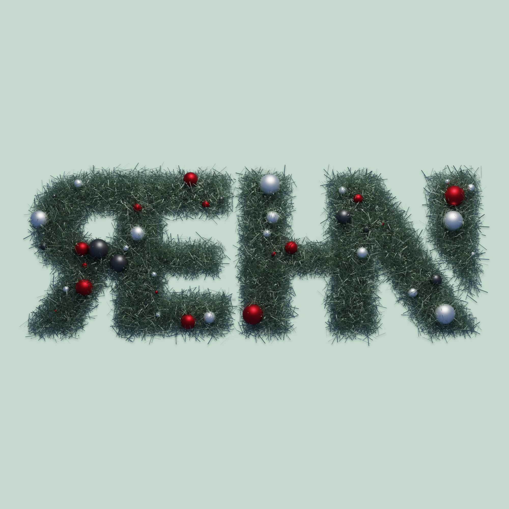
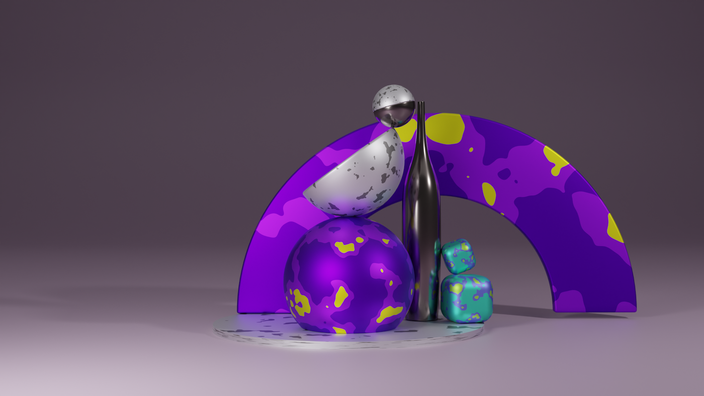
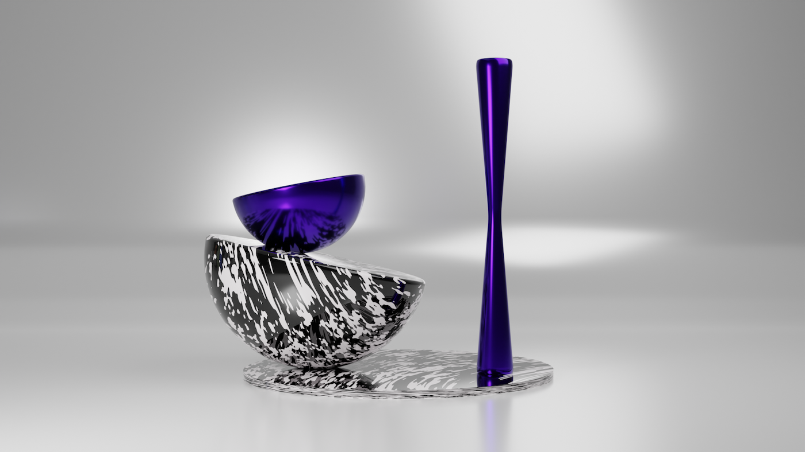
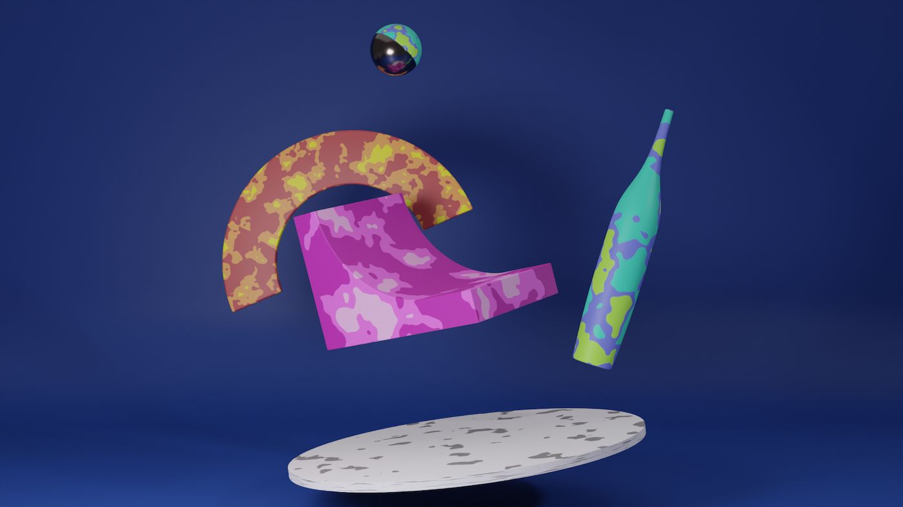
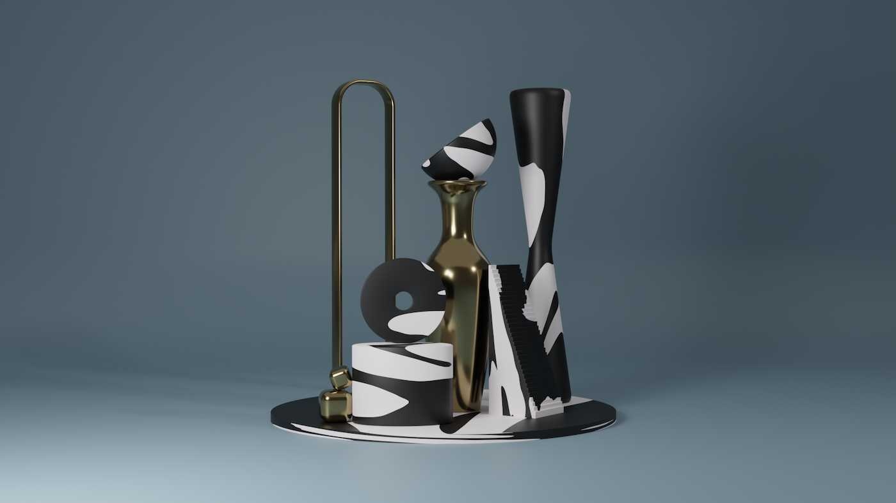
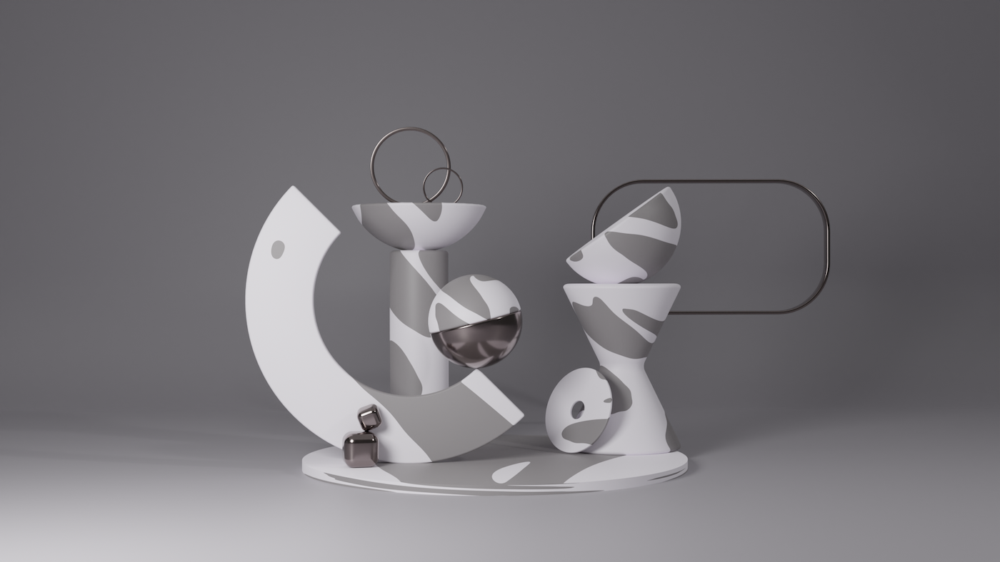
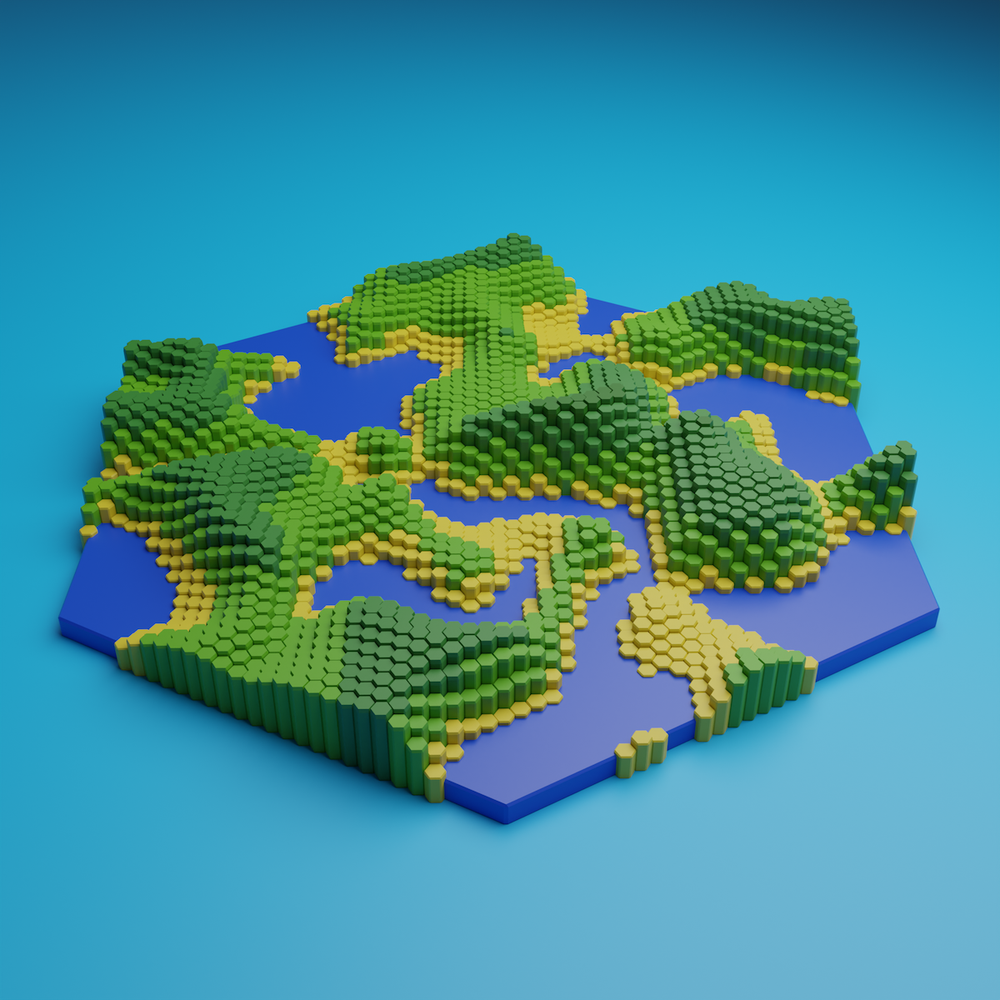
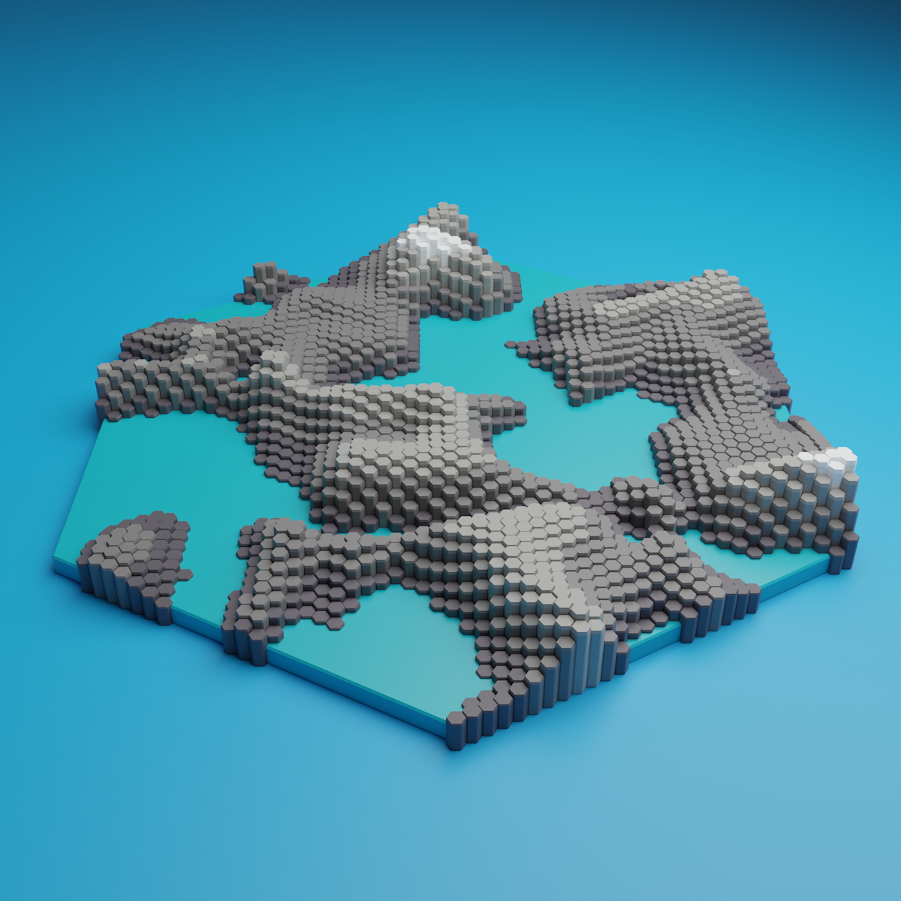
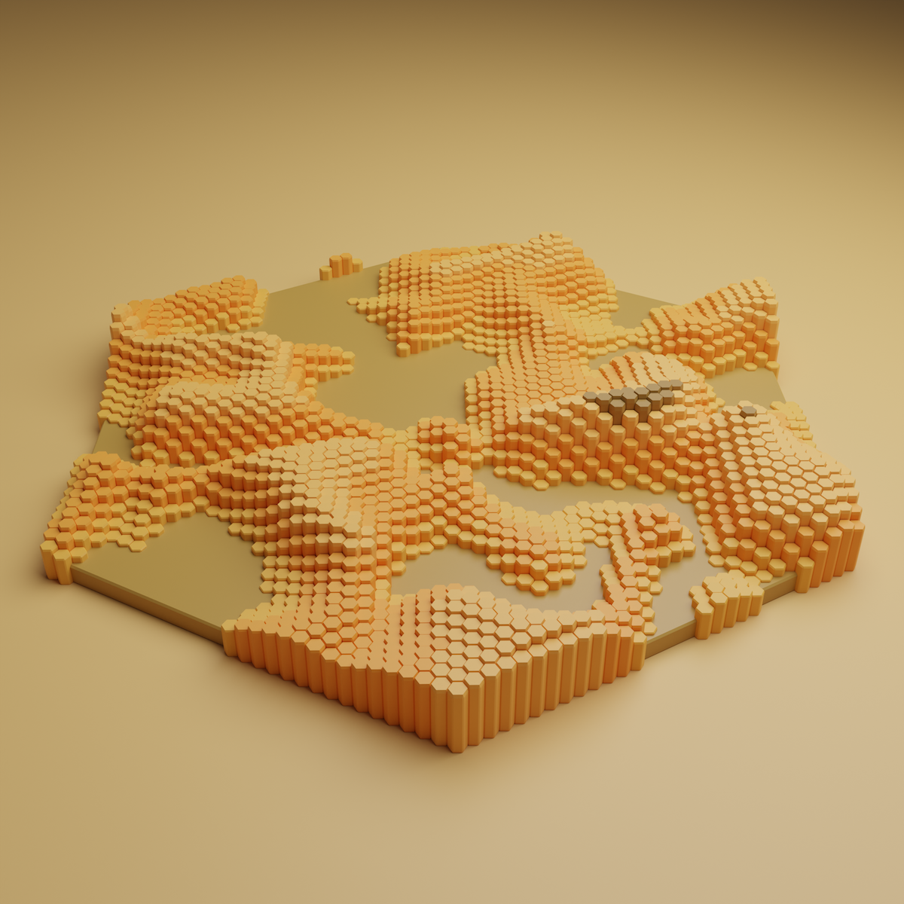
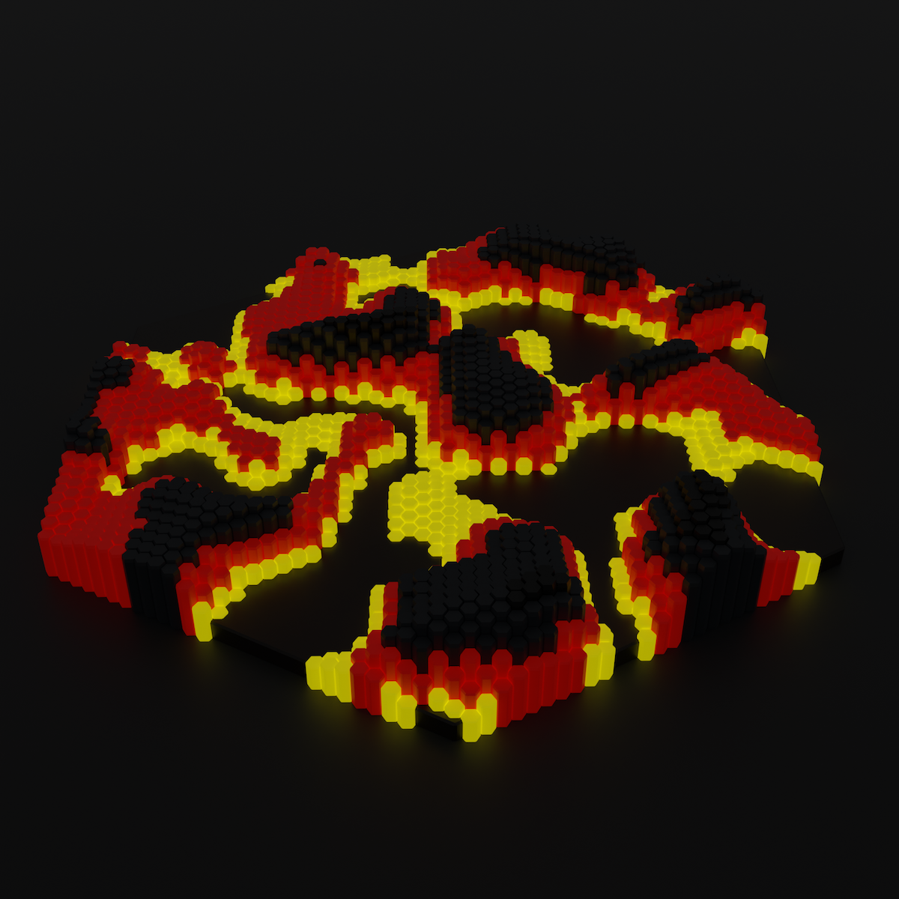

  

    <video autoplay loop muted playsinline width="100%" title="Low poly tea cup">
      <source src="../img/3d-art/tea-cup.mp4" type="video/mp4">
    </video>
  

  

    <video autoplay loop muted playsinline width="100%" title="Low poly mid-century modern styled record player">
      <source src="../img/3d-art/record-player.mp4" type="video/mp4">
    </video>
  

{:.post-callout-medium}
3D explorations in animations and rendered stills.

    
  

  

    
  

  

    
  

  

    
  

  

    
  

  

    
  

  

    
  

  

    
  

  

    
  

  

    
  

  

    <video autoplay loop muted playsinline width="100%" title="Blue ball with a pulsing wave texture">
      <source src="../img/3d-art/ball-pulse.mp4" type="video/mp4">
    </video>
  

  <!-- 

    <video autoplay loop muted playsinline width="100%" title="Floating orb deforming a sea of purple pegs">
      <source src="../img/3d-art/ball-grid-deform.mp4" type="video/mp4">
    </video>
  

  

    <video autoplay loop muted playsinline width="100%" title="">
      <source src="../img/3d-art/purple-pulse.mp4" type="video/mp4">
    </video>
  
 -->

