

  

    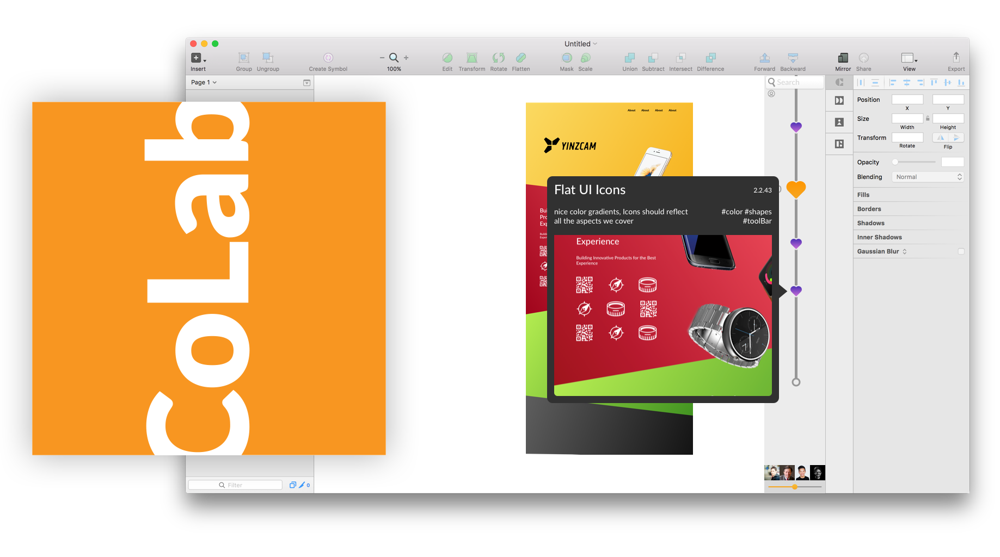
  



{:.post-callout-medium}
Design is inherently collaborative. Existing tools such as Photoshop and Sketch are inconvenient for designers, since they have to work separately, then manually compare designs to resolve differences. Designers end up wasting time on redundant work, due to the lack of standard version control and file sharing methods.

We Look to solve this problem with our new product CoLab. CoLab is a plugin that enables real-time collaboration and version control in Sketch, a popular tool among designers, and makes it convenient for them to design with their teams anytime, anywhere.

  <iframe width="100%" src="https://www.youtube.com/embed/w0ZcpQ547Gg?rel=0" frameborder="0" allowfullscreen title="CoLab Product Introduction"></iframe>

As part of this project I worked with Alex Du, Aparna Sridhar Murthy, Chris Barker, Rishikesh Yardi.

  

    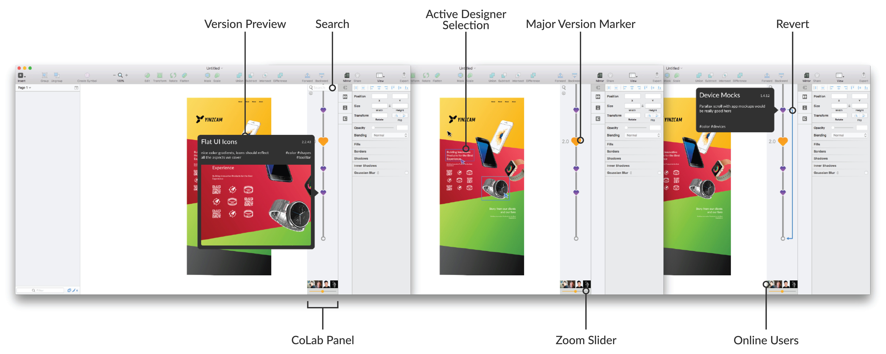
  

  

    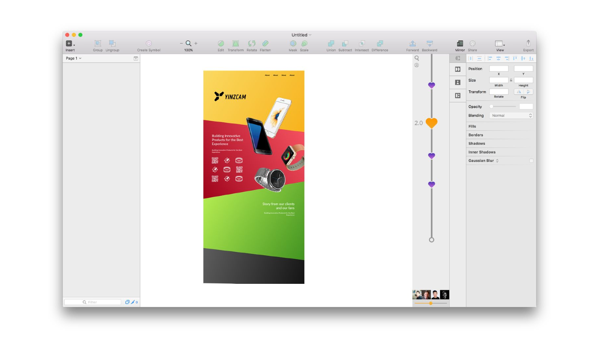
  

  

    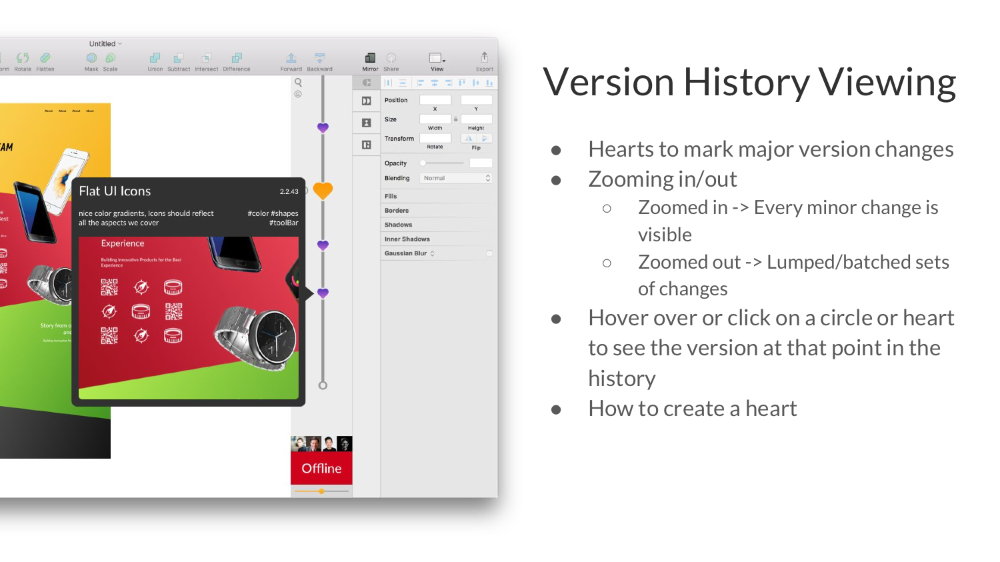
  

  

    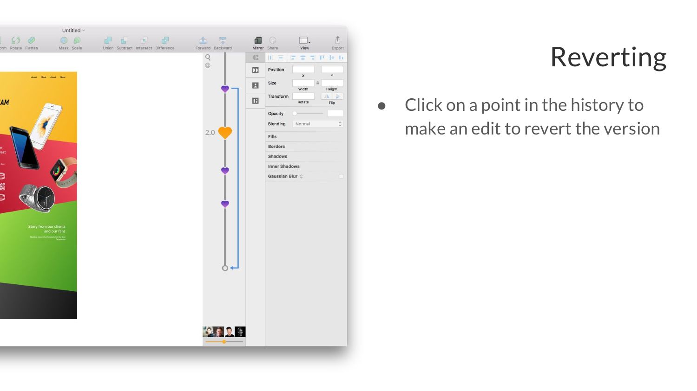
  

  

    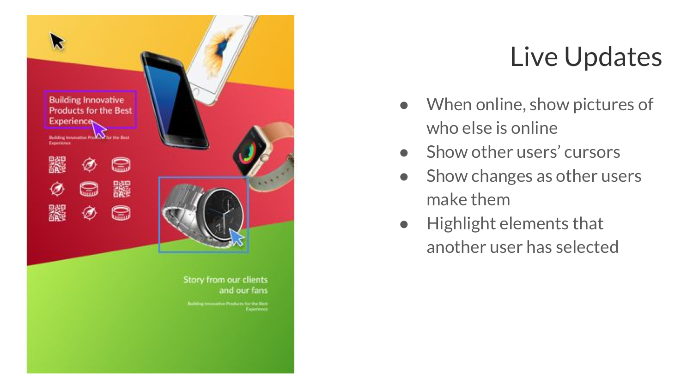
  

  

    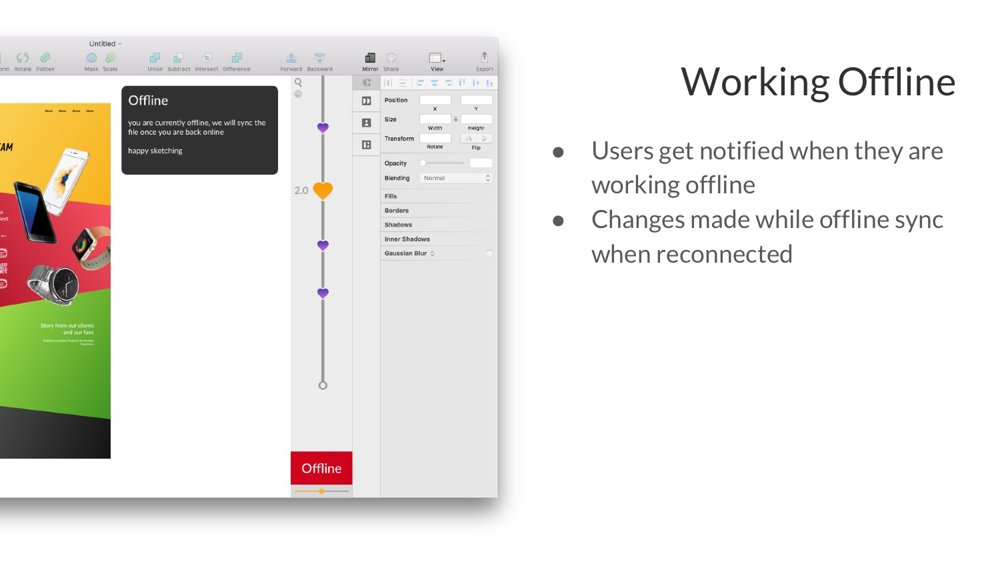
  

  

    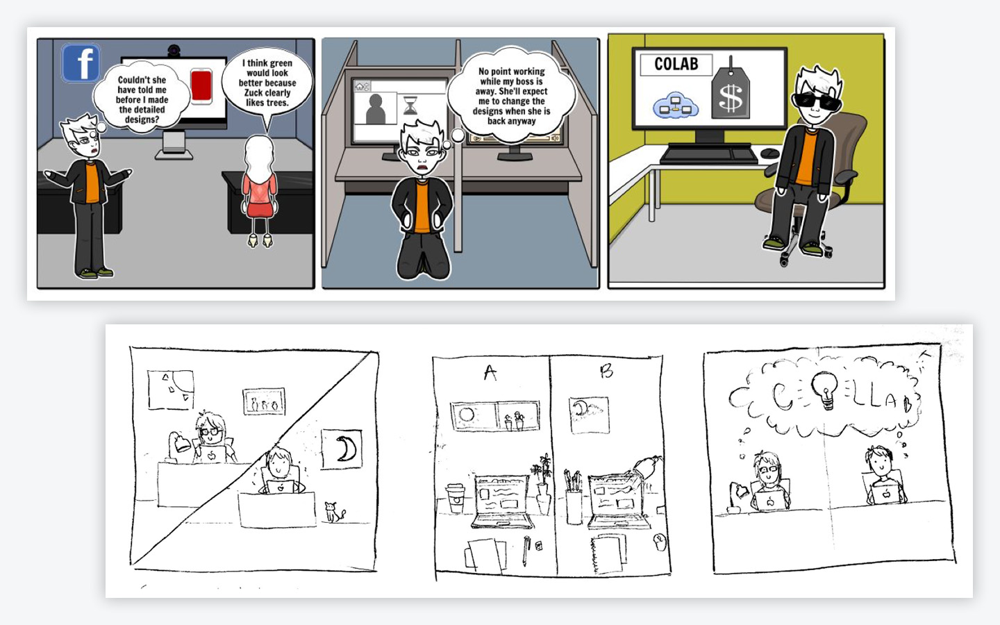
  

  

    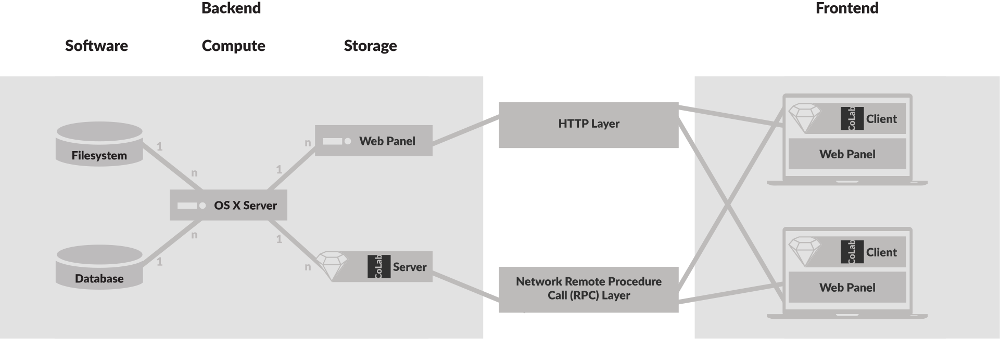
  

Now that we have seen the product let's discuss the business side. Our target market is UI/UX designers and existing sketch users and through proxy data we know that the market is quite large. In the United States alone there are 261,000 graphic designers, 38,000 industrial designers, 74,600 art directions.* (*Bureau of Labor Statistics, U.S. Department of Labor, Occupational Outlook Handbook, 2016-17 Edition)

#### Our research hypotheses are as follows:
- The collaboration tools designers have access to are not solving the problem
- Designers would be able to collaborate better if they could see real-time updates made by their fellow designers
- Design teams would be able to collaborate better if multiple designers could edit the same file at the same time
- Designers would benefit from a version control system

#### Insights
- 82.5% of designers collaborate with peers on their projects
  - Work is generally split by software or phase (wireframe, style guide)
- Most commonly used tools
  - Sketch - 48.1%
  - Photoshop & InDesign - 59.3%
  - Illustrator - 74.1%
- Major pain points
  - Version control & file sharing
  - Simultaneous editing to maintain consistency
- Need for enterprises and consumer level solutions

#### Marketing & Sales Strategies
- Peer-to-peer
- Advertizing
- "Reference customer" companies
- Word-of-mouth & advocacy
- Hackathons
  - Disrupt
  - MHacks
  - AngelHack
- Design conferences
  - UXPA
  - ConFab
  - AIGA
- Early adopter promotions
  - Discounts
  - Trial periods

  

    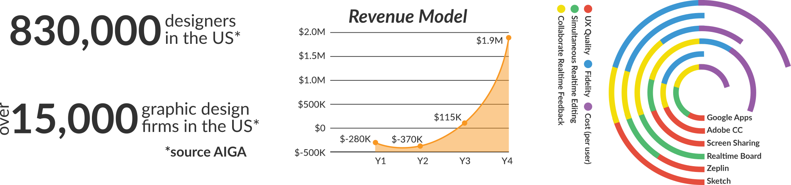
  

  

    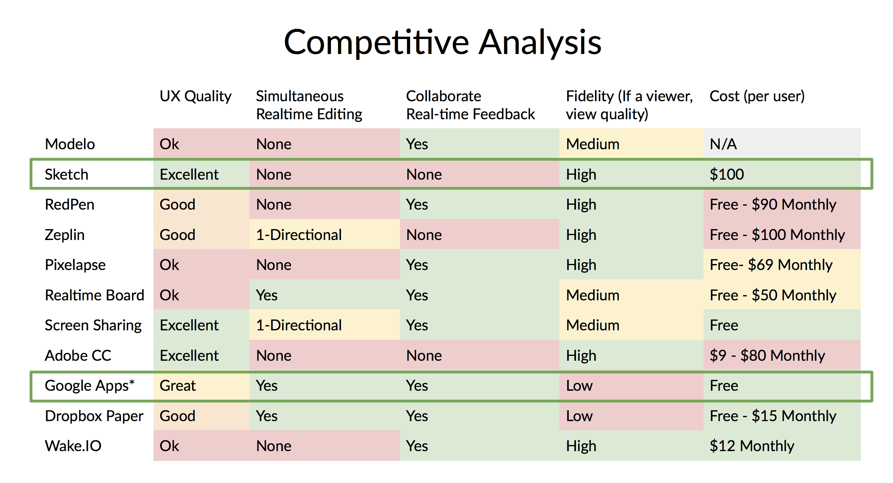
  

  

    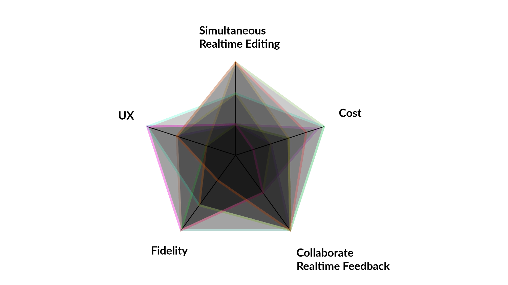
  

  

    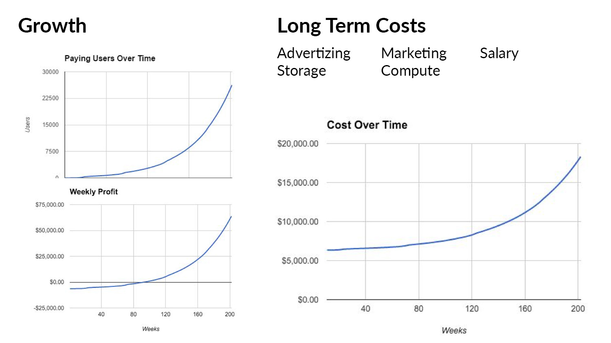
  

  

    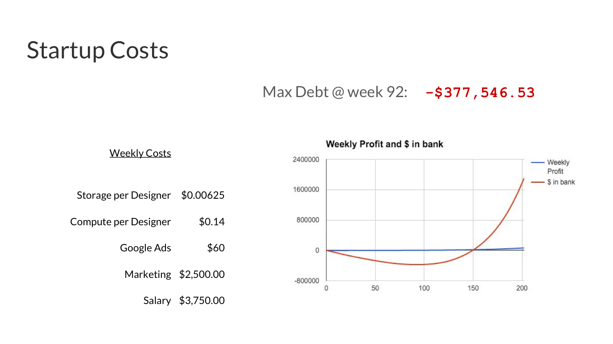
  

  

    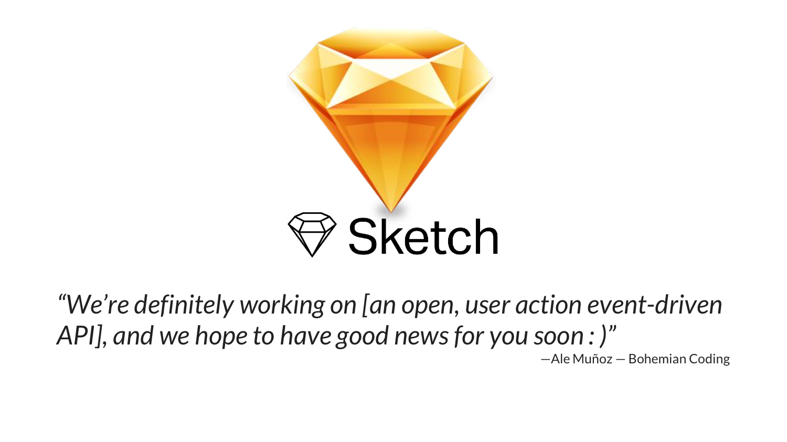
  

  

    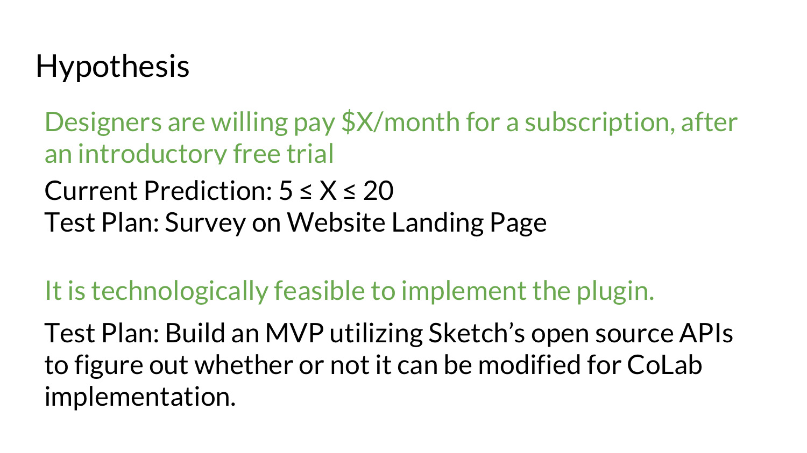
  

  

    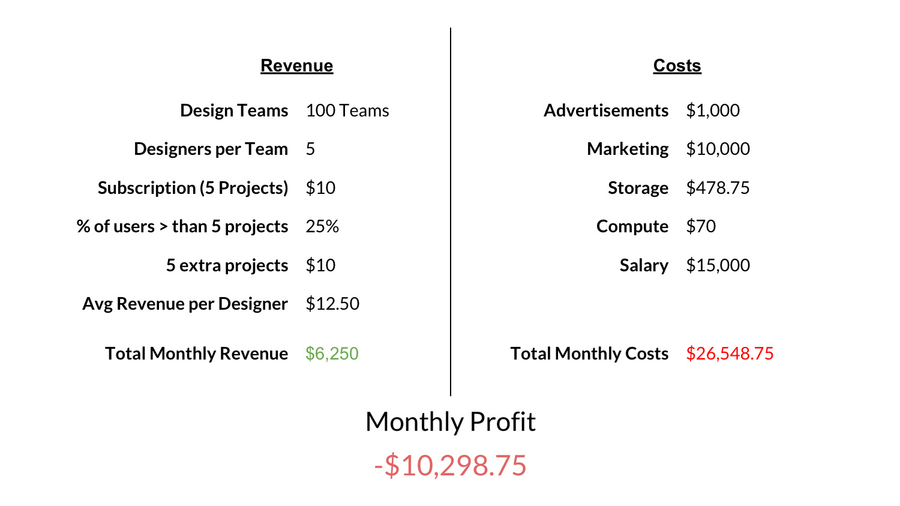
  

