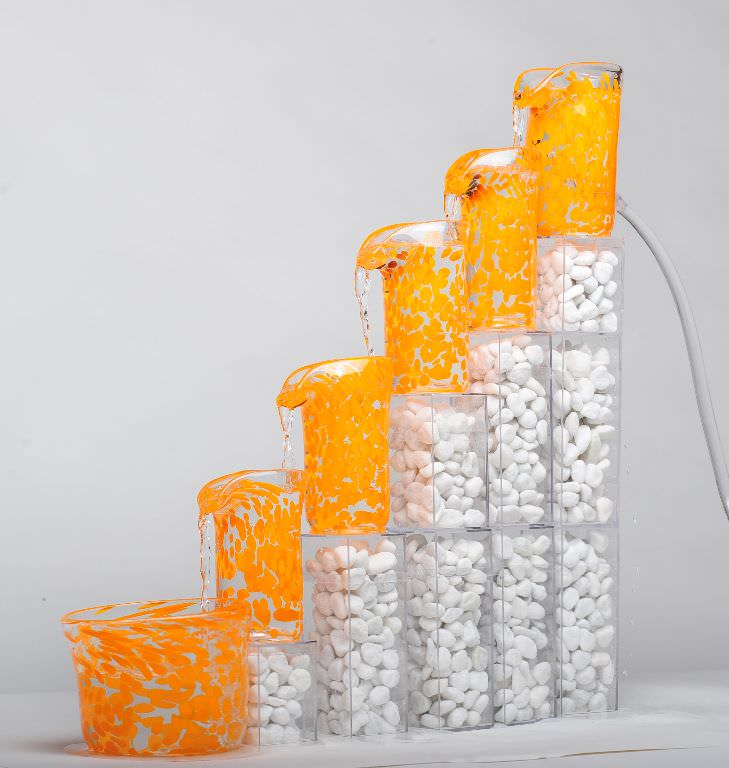
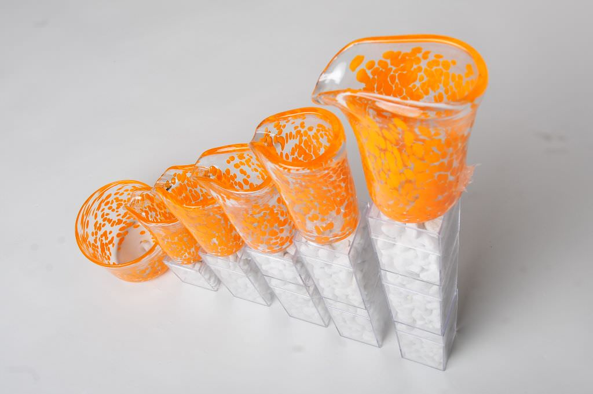
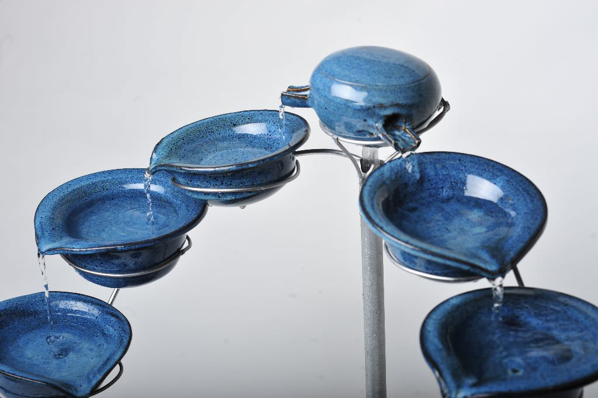
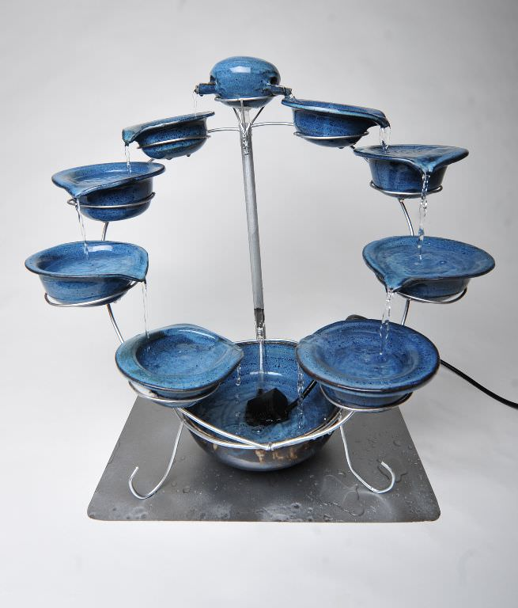
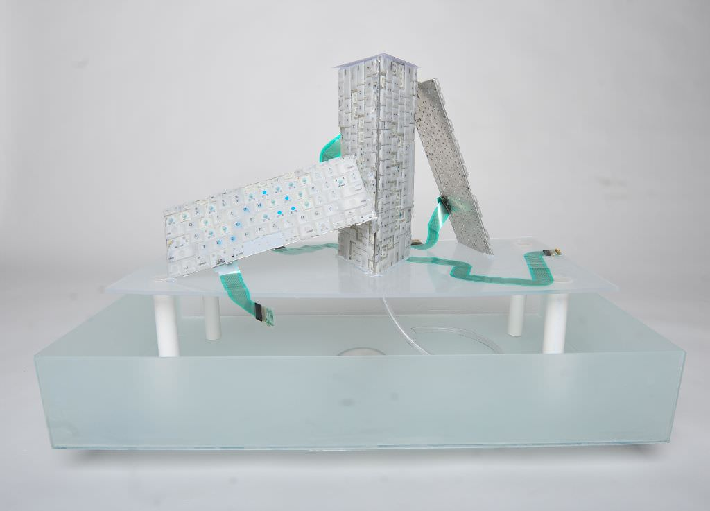
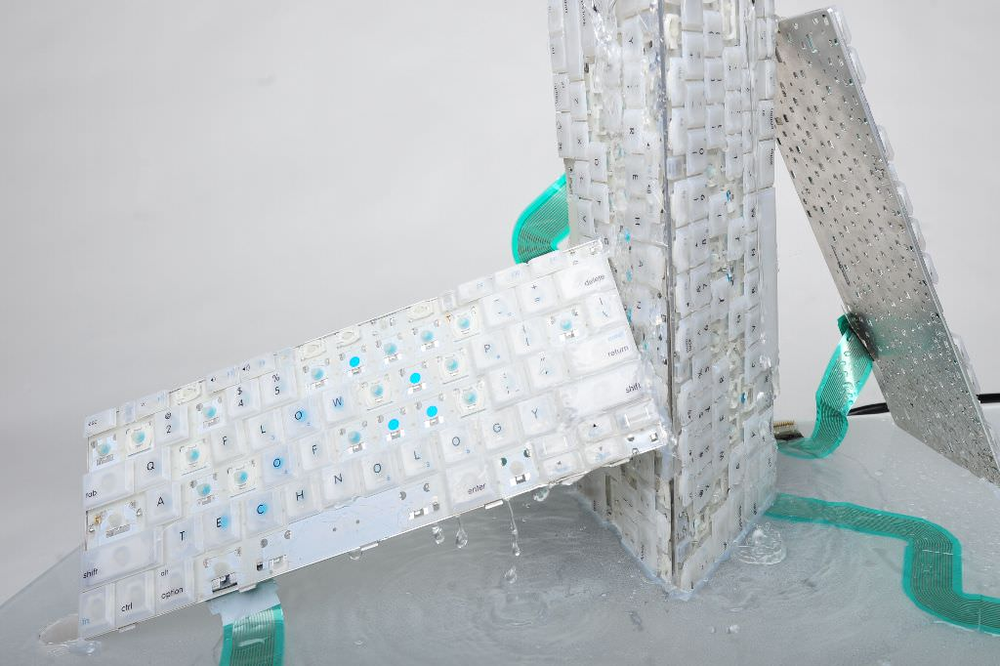
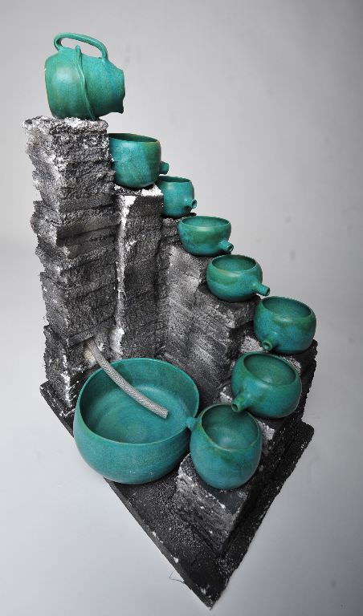
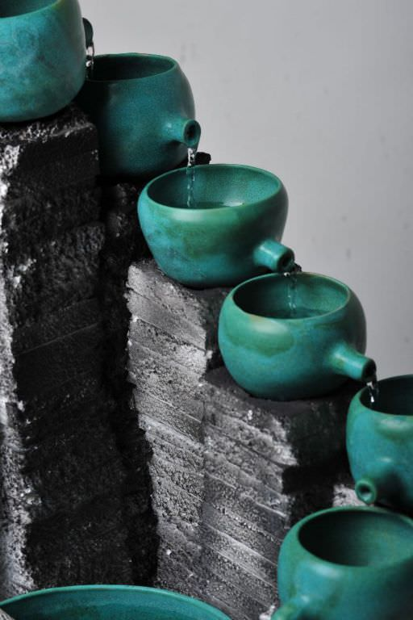
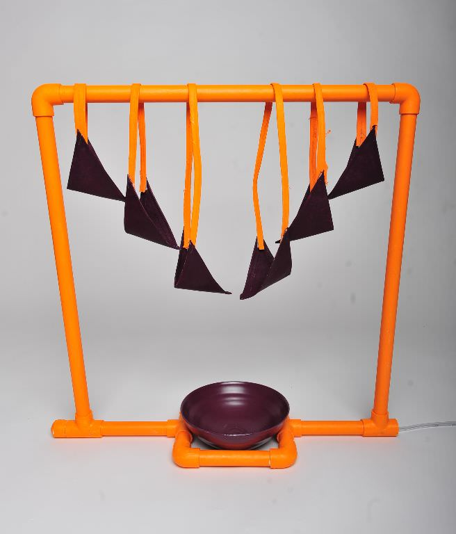
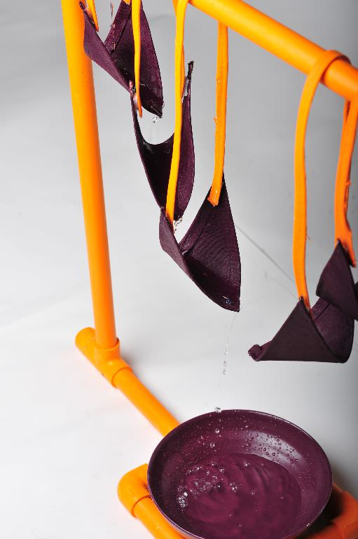

  

     Should be .scaffold-flex-intrinsic with --aspect-ratio: Scaffold documents it but its Sass doesn't ship it yet. 
    

      
    

    

      
    

  

  

     Should be .scaffold-flex-intrinsic with --aspect-ratio: Scaffold documents it but its Sass doesn't ship it yet. 
    

      
    

    

      
    

  

    

      
    

    

      
    

    

      
    

    

      
    

    

      
    

    

      
    

