

  

    
  

Interchange, a career event, was created as a way to help the graduate students of Carnegie Mellon’s School of Architecture connect with the creative industry. As part of this new initiative I branded and developed a website for students to showcase their work ahead of the event. It provided organizations an opportunity to learn about student's work within different degree programs; from architectural building performance to computational design.

  

    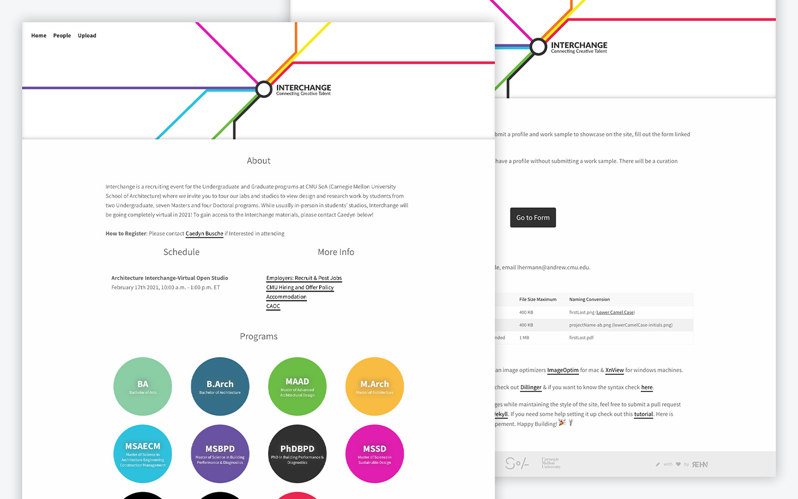
  

  

    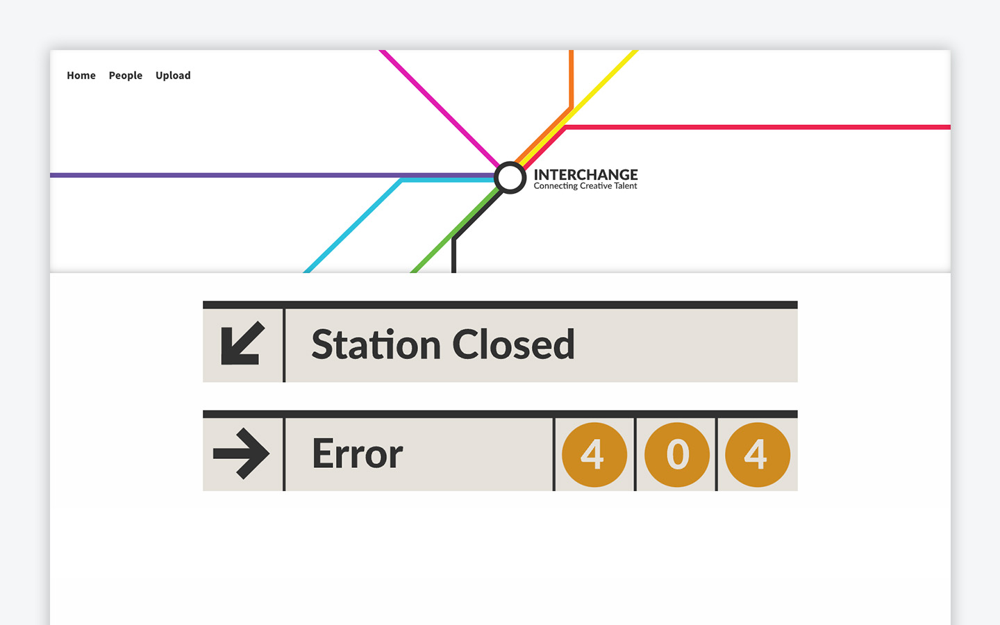
  

    

      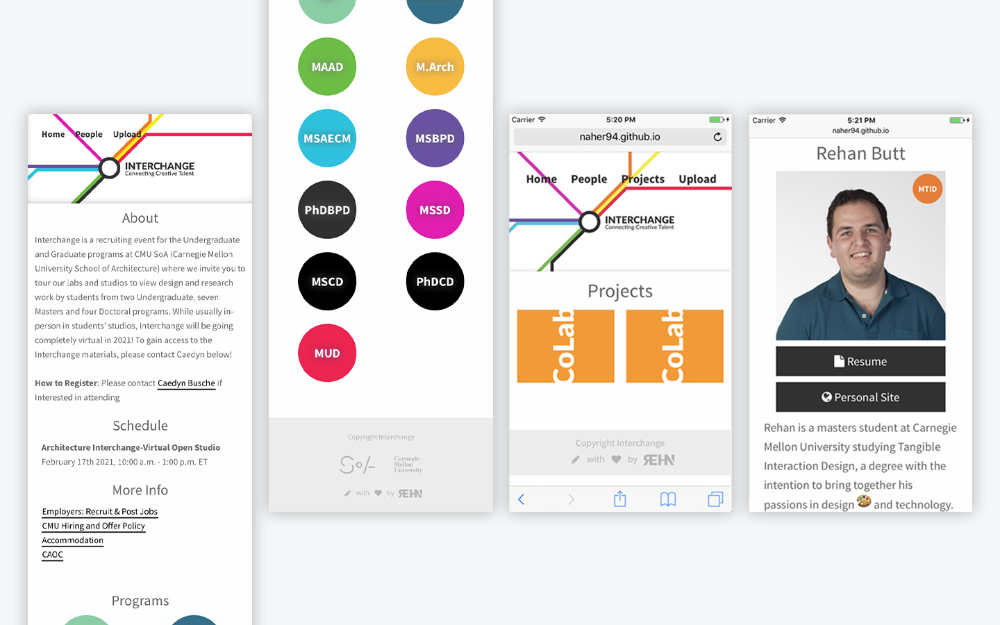
  

As this site was used by many students, I templated and created a style guide throughout the site for a uniform look and feel. Keeping in mind the need for a variety of content types and optional information fields such as personal websites and resumes on the profile pages. I built the site using Jekyll to template each page and to automate the connection of pages such as people and their projects and tagging people with their degree program. If you are curious to learn more feel free to 

  

    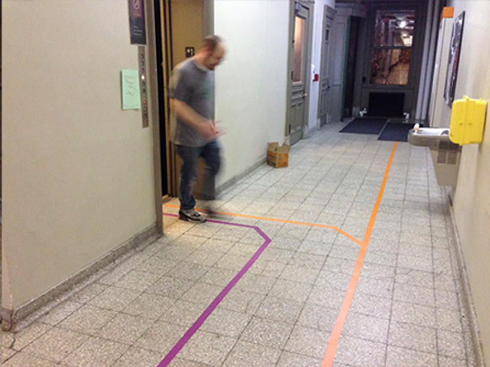
  

  

    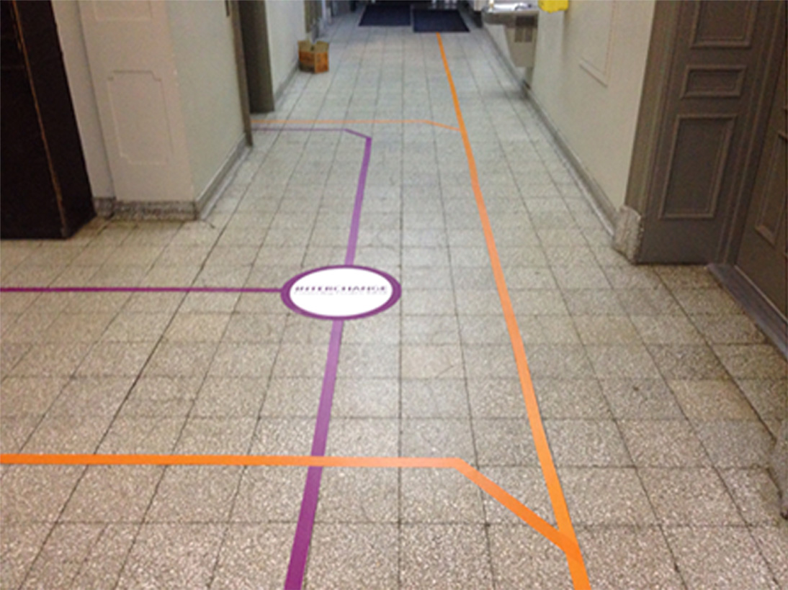
  

  

    

      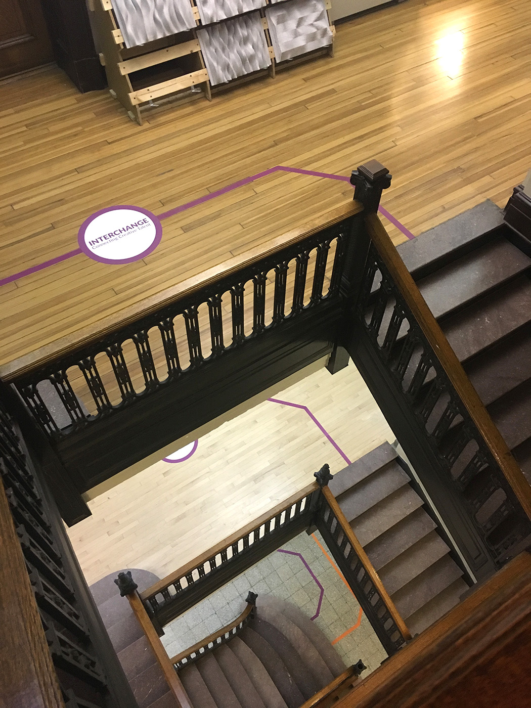
    

    

      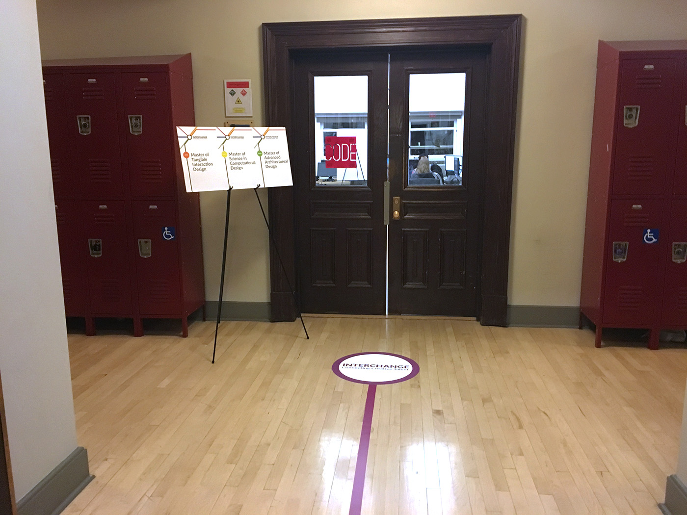
    

  

  

    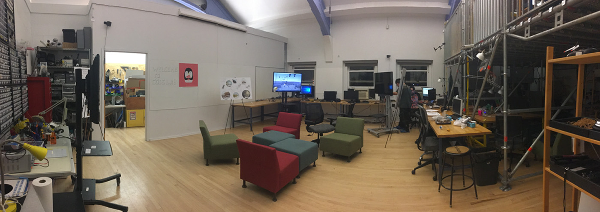
  

## Process

  

    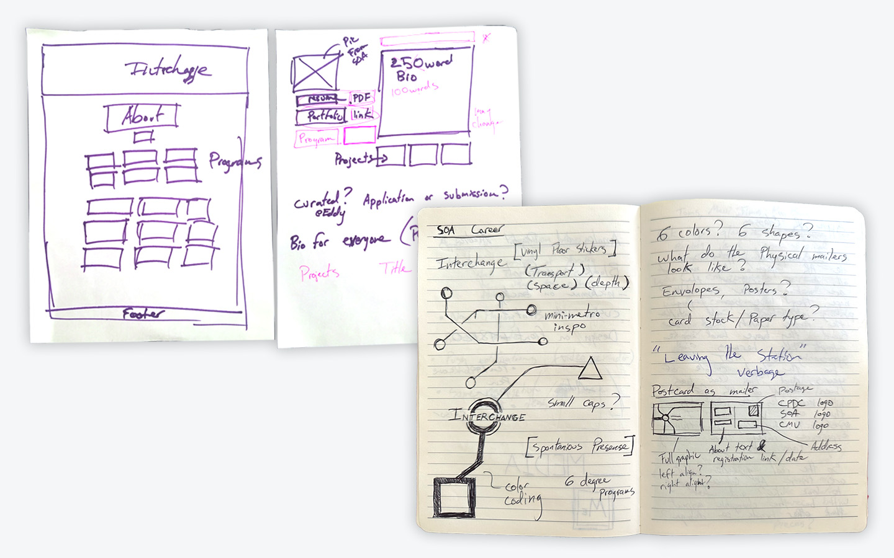
  

  

    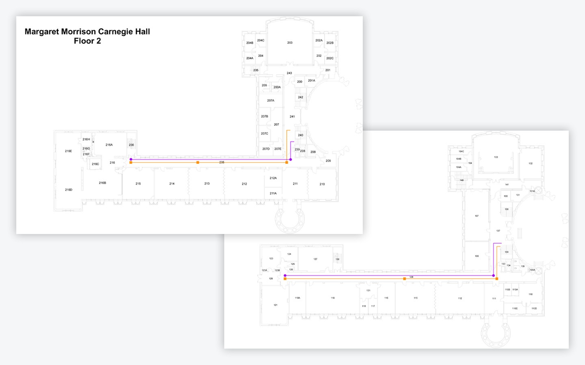
  

  

    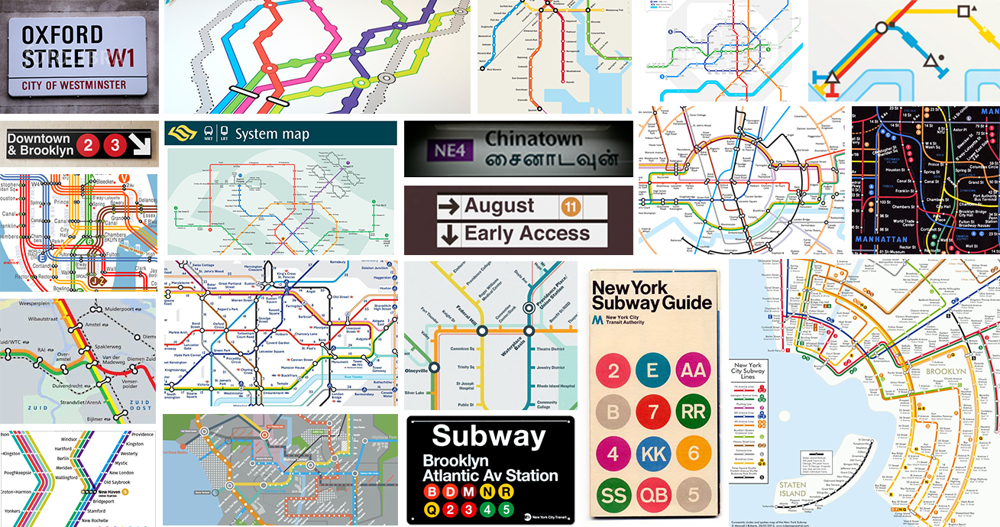
  

  

    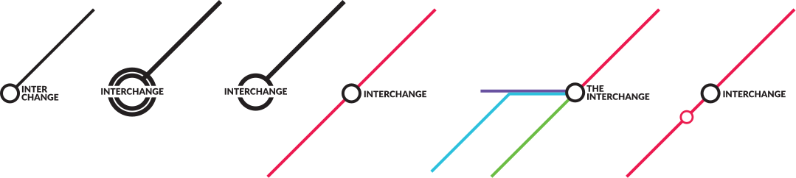
  

  

    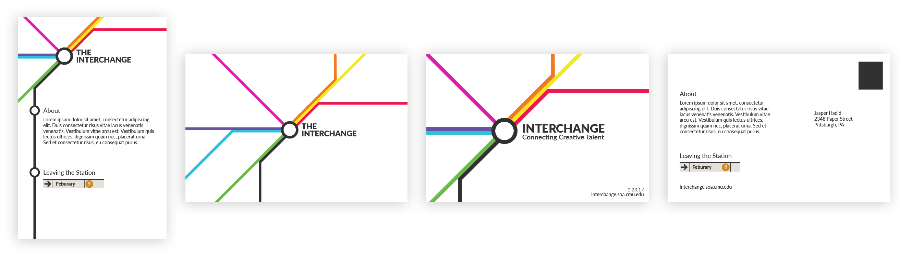
  

  

    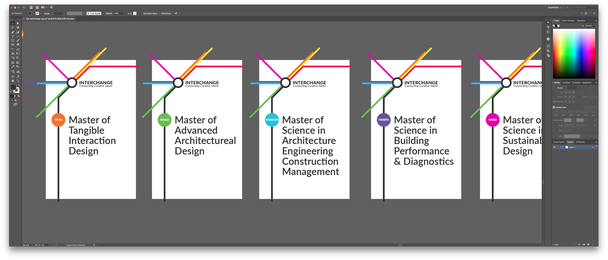
  

  

    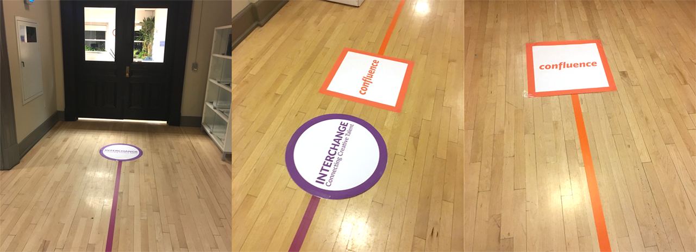
  

