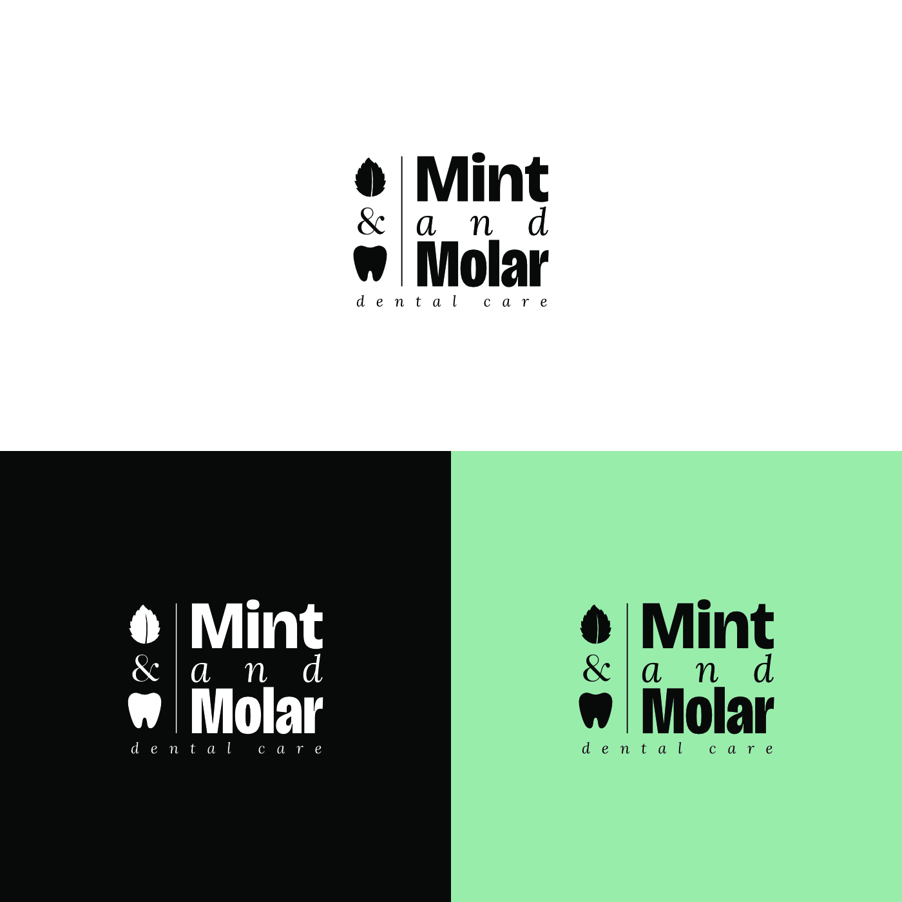
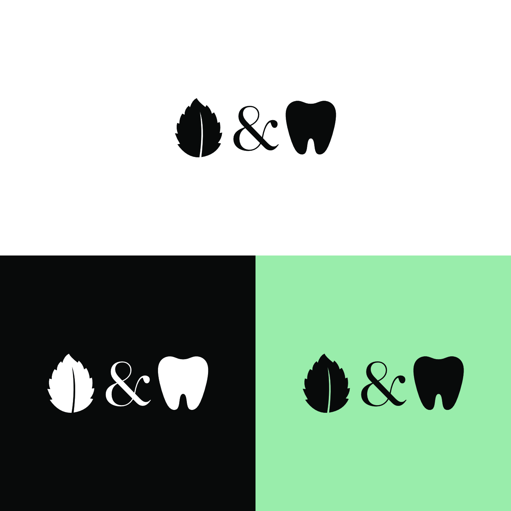
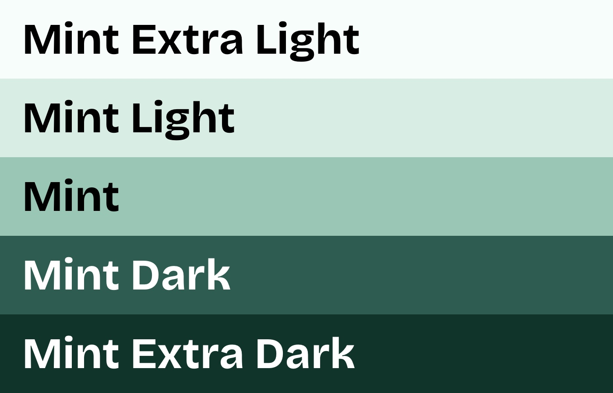
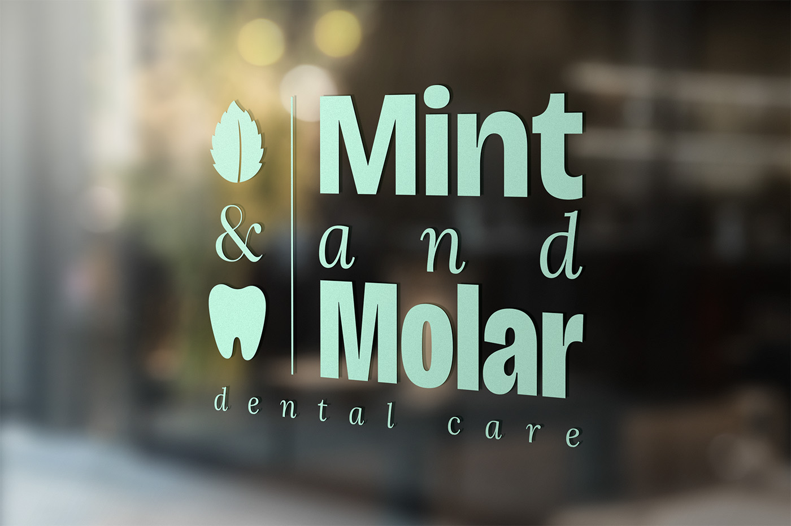
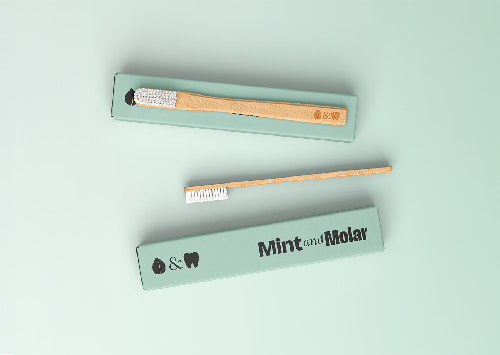
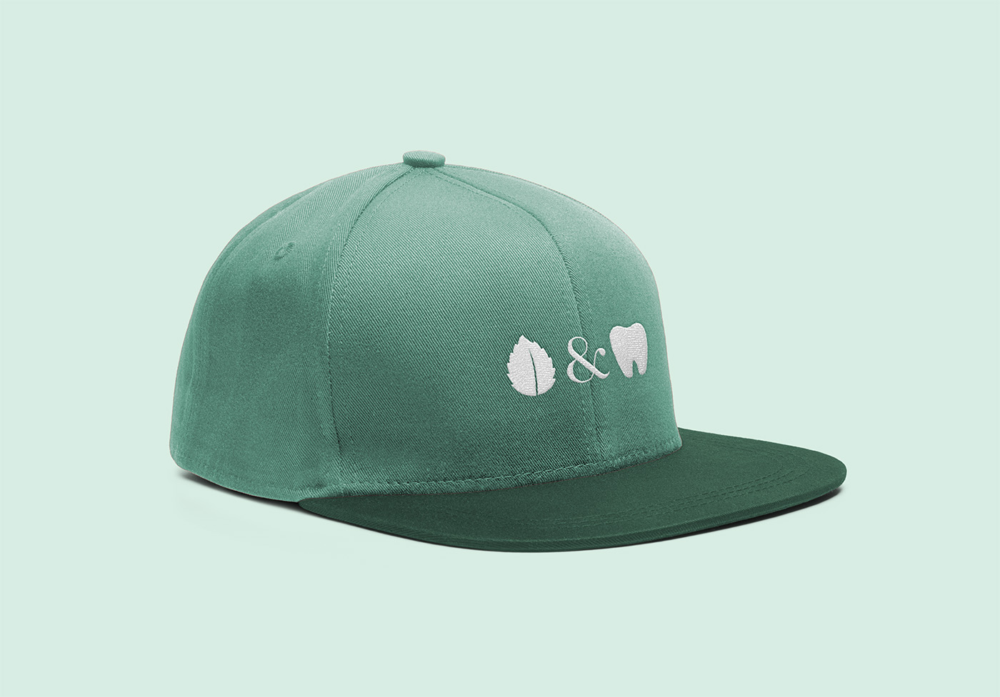

Mint & Molar needed a brand identity that felt as fresh and approachable as the care they provide. I built a complete visual system — logo lockup, icon mark, color palette, and a set of real-world applications — that brings a warm, modern feel to a dental practice without losing the trust and polish patients expect.

  

    
  

  

    
  

  

    
  

  

    
  

  

    
  

  

    
  

