

  

    
  

{:.post-callout-medium}
Stripping back complexity to reveal a sharper, smarter visual identity rooted in my name.

With the refresh of my site I also wanted to refresh my visual brand identity, specifically reduce the complexity of the graphic while keeping the reference to my name. One of the first elements I looked into was reducing the number of horizontal lines in the logo, then crisping up the corners by removing the chamfers.

  

    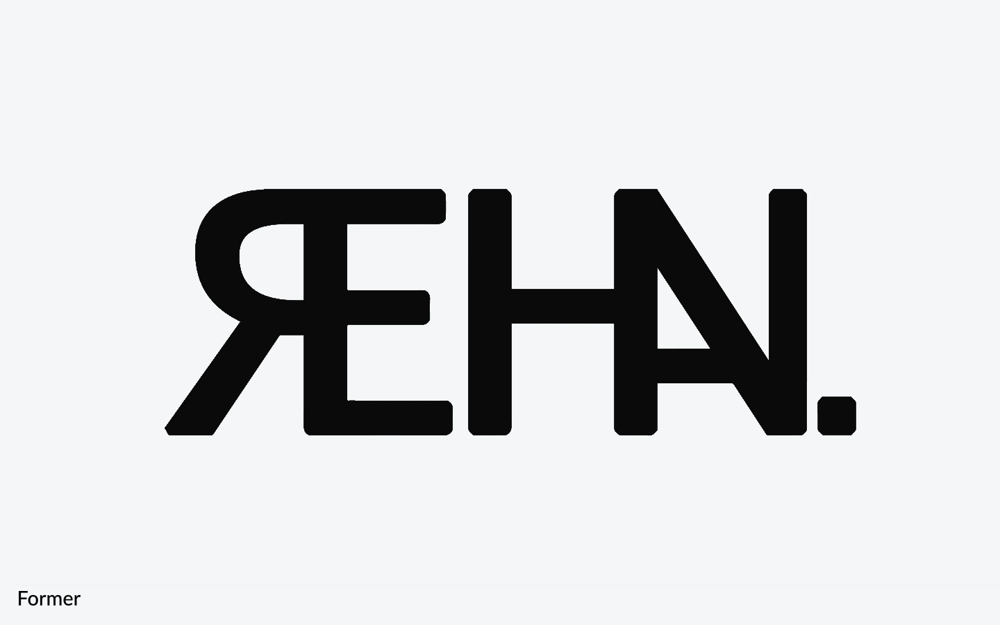
  

  

    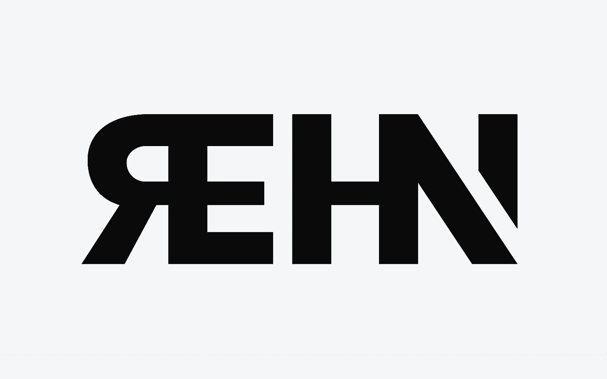
  

  

    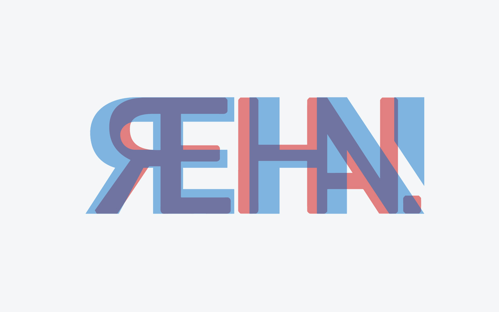
  

  

    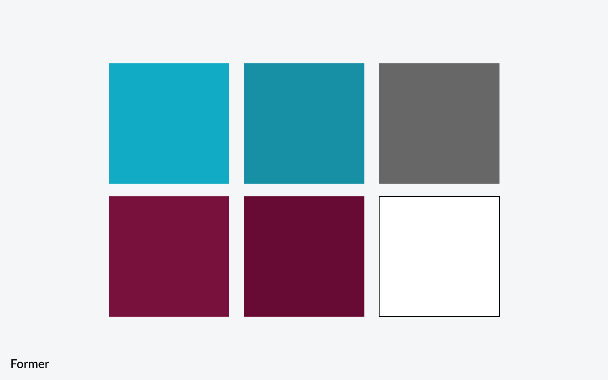
  

  

    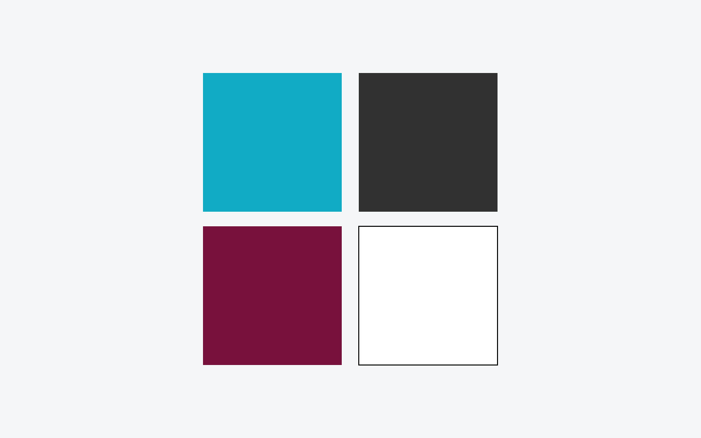
  

  

    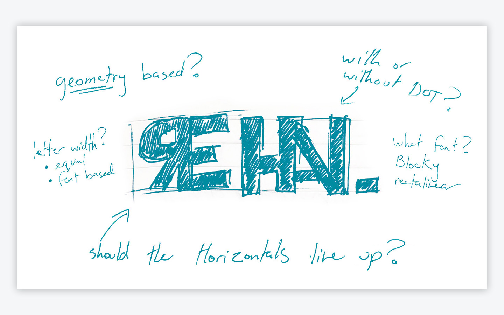
  

  

    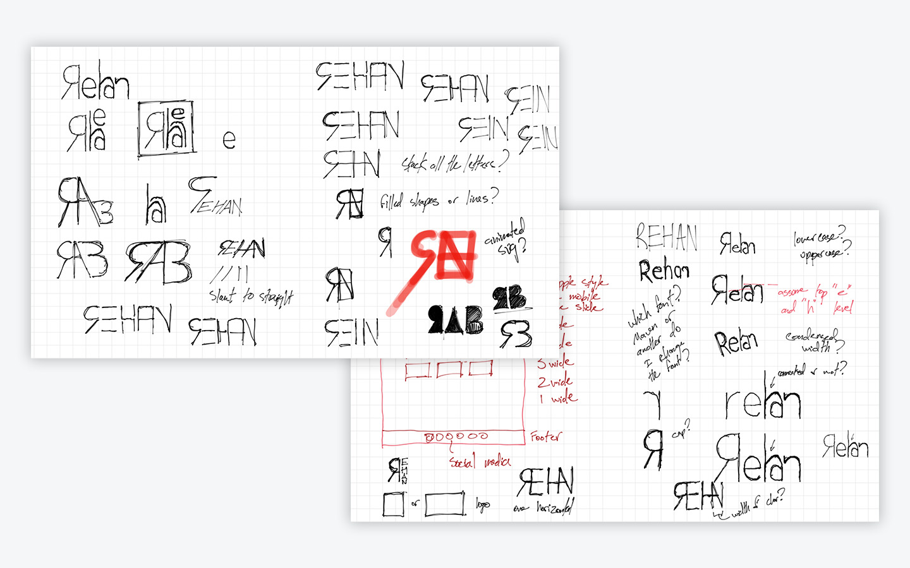
  

  

    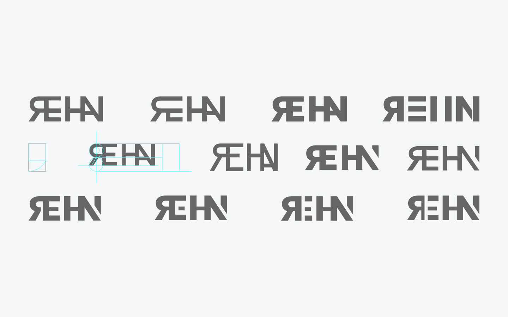
  

  

    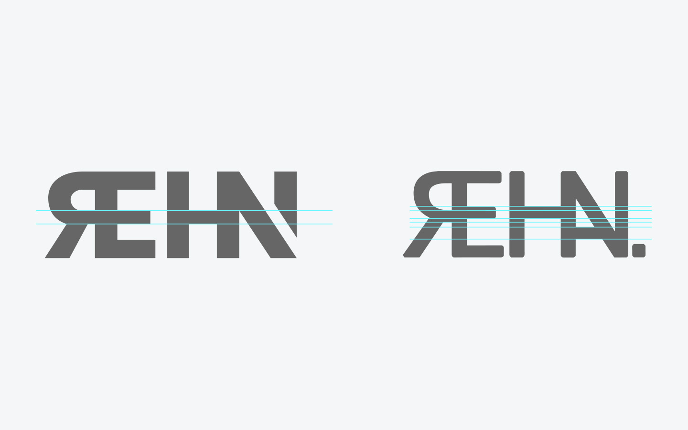
  

  

    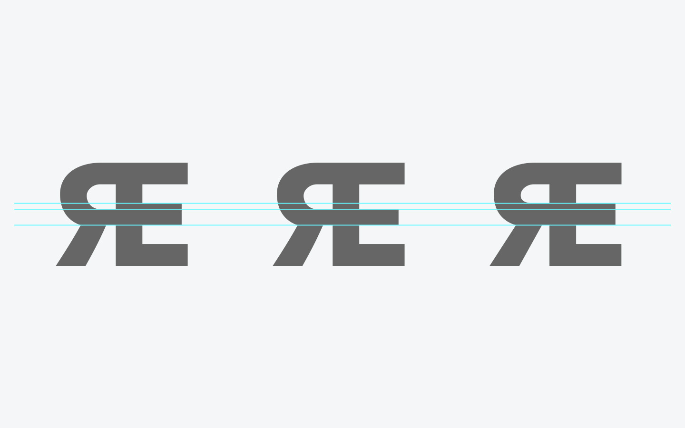
  

{:.post-callout-medium}
In order to reduce the number of horizontal lines I had to either slide the middle segment of the “E” down or move the “R” horizontal up. I decided to slide the “E” segment down so that I did not mess with the curvature of the “R”.

  

    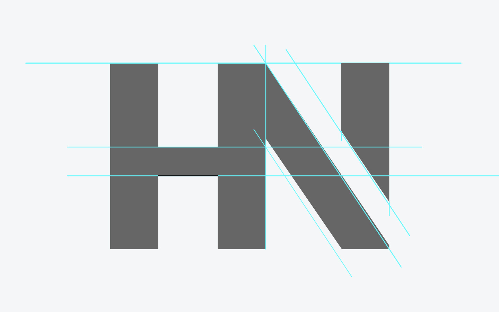
  

  

    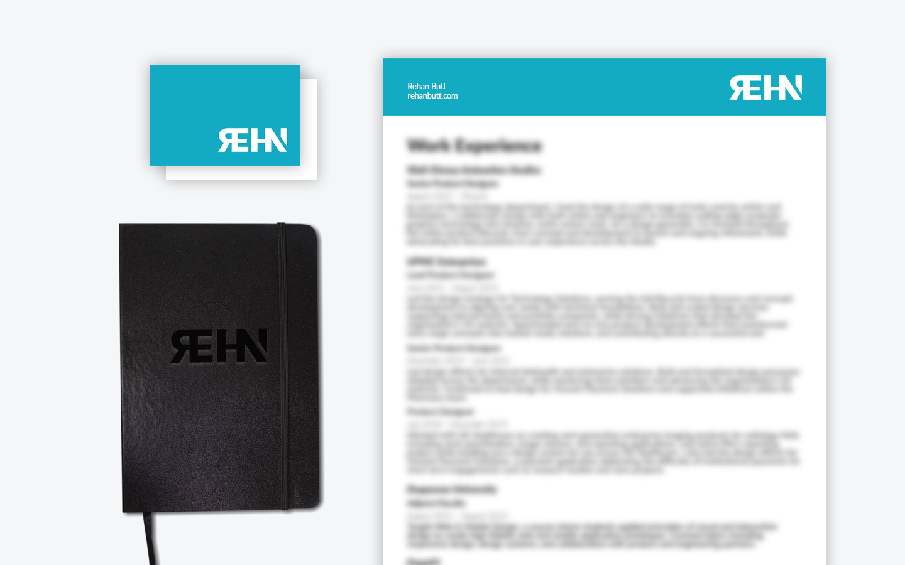
  

