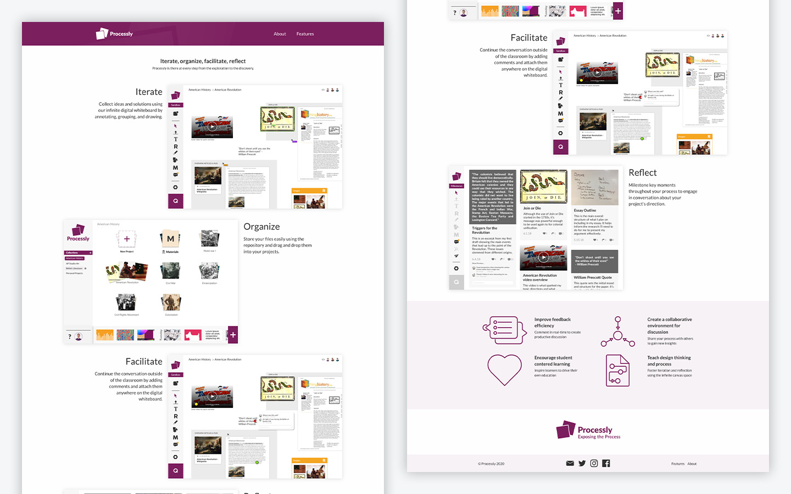
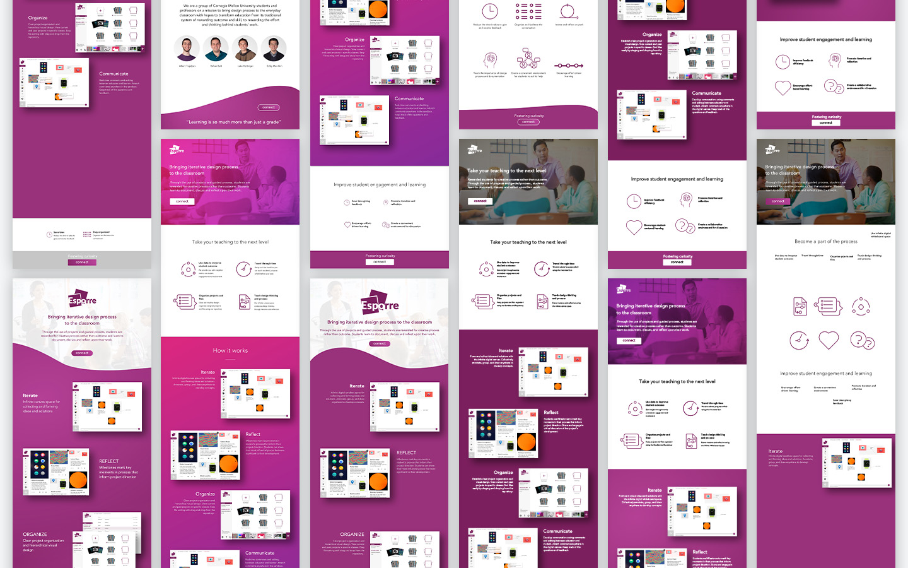
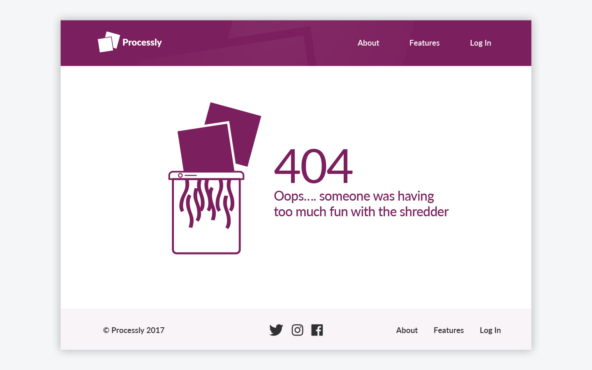

  

    
  

{:.post-callout-medium}
Exposing the Process.

As with the Processly tagline, Exposing the Process, I wanted to expose the process we took to create the splash page for Processly, showcasing the key values and features of the product and of course having a bit of fun along the way!

<!-- Learn more about the core product. PROCESSLY PROJECT LINK HERE. -->

  

    
  

  

    
  

  

    
  

Having fun with the 404 page!