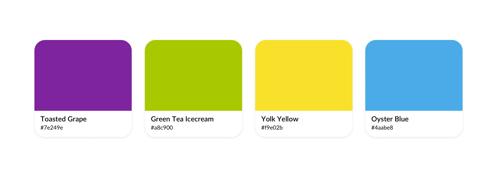
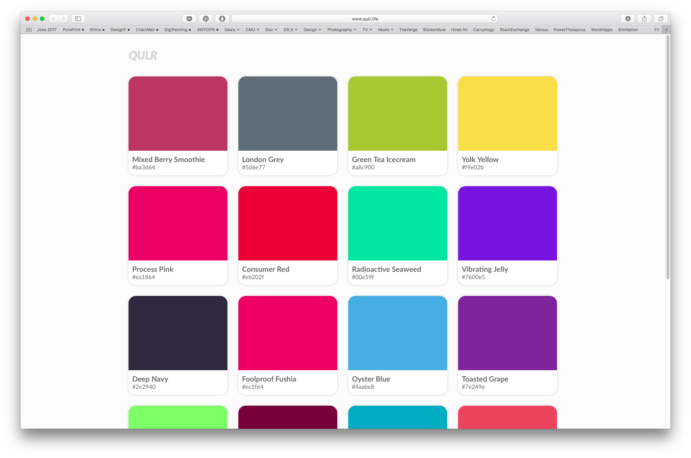
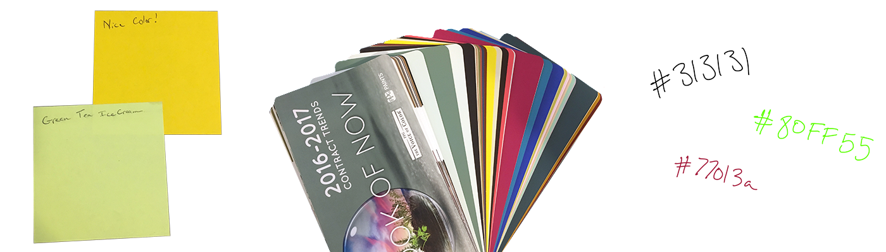
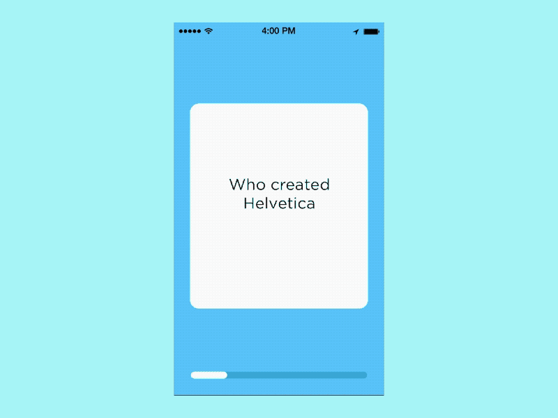
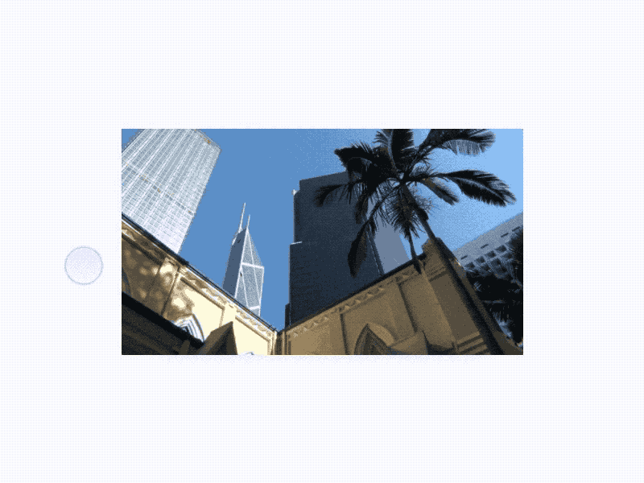
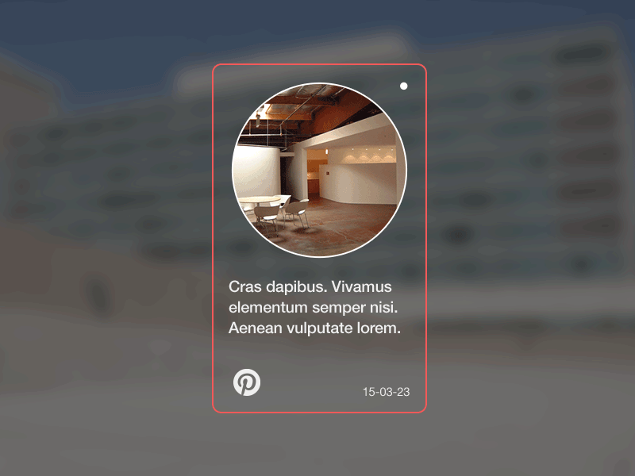
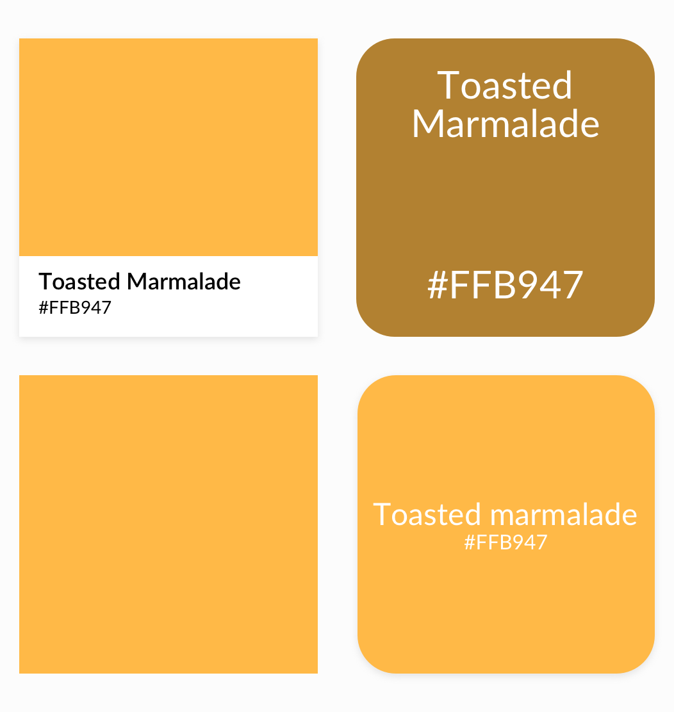
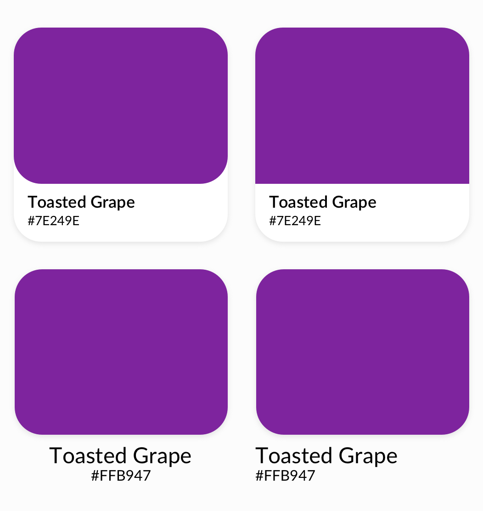

I’m a big fan of color and creating fun names for them. As such I started QULR as a first step of a much larger exploration and tool creation surrounding color.  is my way of sharing some of the many fun colors I come across.

## Process

I wanted a better way to hold my colors. Collecting Post-its, swatch books and just writing down color values was not a great solution.

  

  

  

  

  

    
  

  

    
  

Several iterations of the cards I designed.
